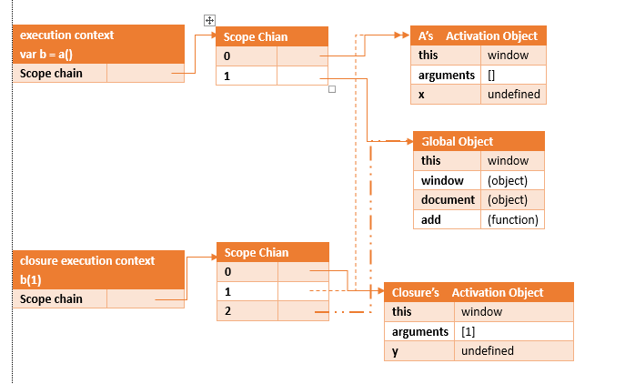

## 比较iOS的block和js的闭包

### 定义

#### iOS

块与函数类似，只不过是直接定义在另一个函数里，和定义它的那个函数共享同一个范围内的东西。

#### js

闭包是指有权访问另一个函数作用域中变量的函数。

### 访问外部变量

#### iOS
 
- 全局块不引用外部变量，所以不用考虑。
- 堆块引用的外部变量，不是原始的外部变量，是拷贝到堆中的副本。
- 栈块本身就在栈中，引用外部变量不会拷贝到堆中。

#### js

函数在每次执行前，会创建一个**执行环境**对象，每一个环境都有自己的作用域链。

```
function a(){
    var x = 0;
    return function(y){
        x = x + y;
        return x;
    }
}
var b = a();
b(1);
```



上述代码在执行的时候，b得到的是闭包对象的引用，虽然a执行完毕后，但是a的活动对象由于闭包的存在并没有被销毁，在执行b(1)的时候，仍然访问到了x变量，并将其加1，若在此执行b(1)，则x是2，因为闭包的引用b并没有消除。

### 内存泄漏

#### iOS

堆块访问外部变量时会拷贝一份指针到堆中，相当于强引用了指针所指的值。如果该对象又直接或间接引用了块，就出现了循环引用。
解决方法：要么在捕获时使用__weak解除引用，要么在执行完后置nil解除引用（如果未执行，则会内存泄漏）。

#### JS

IE9及以下的版本使用的是引用计数的内存回收机制，当引用计数为0的时候将会回收。这是因为，IE中有一部分对象并不是原生额javascript对象，例如，BOM和DOM中的对象就是以COM对象的形式实现的，而COM对象的垃圾回收机制采用的就是引用计数。因此，虽然IE的javascript引擎采用的是标记清除策略，但是访问COM对象依然是基于引用计数的，因此只要在IE中设计COM对象就会存在循环引用的问题！

循环引用的情况：

```
window.onload = function(){
    var el = document.getElementById("id");
    el.onclick = function(){
        alert(el.id);
    }
}
```

这段代码执行时，将匿名函数对象赋值给el的onclick属性；然后匿名函数内部又引用了el对象，存在**循环引用**，所以不能被回收。
解决方法：

```
window.onload = function(){
    var el = document.getElementById("id");
    var id = el.id; //解除了循环引用
    el.onclick = function(){
        alert(id); //并没有出现循环引用
    }
    el = null; // 将闭包引用的外部活动对象清除
}
```

### 优缺点

#### iOS

优点：

- 捕获外部变量
- 降低代码分散程度

缺点：

- 循环引用引起内存泄露

#### js

优点：

- 可以让一个变量常驻内存 (如果用的多了就成了缺点）
- 避免全局变量的污染
- 私有化变量

缺点：

- 因为闭包会携带包含它的函数的作用域，因此会比其他函数占用更多的内存
- 引起内存泄露

### 参考

- [iOS block](https://github.com/liuyanhongwl/ios_common/blob/master/files/block.md)
- [谈js中的作用域链和闭包](https://segmentfault.com/a/1190000003935661)
- [[ JS 进阶 ] 闭包，作用域链，垃圾回收，内存泄露](https://segmentfault.com/a/1190000002778015)