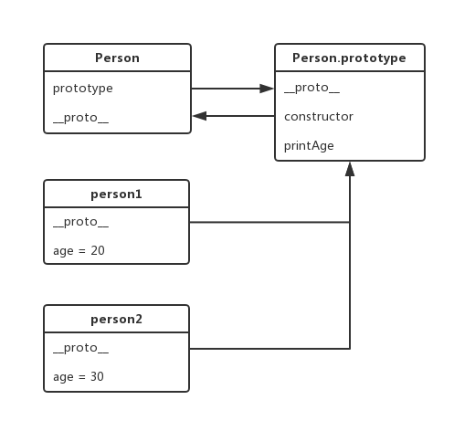
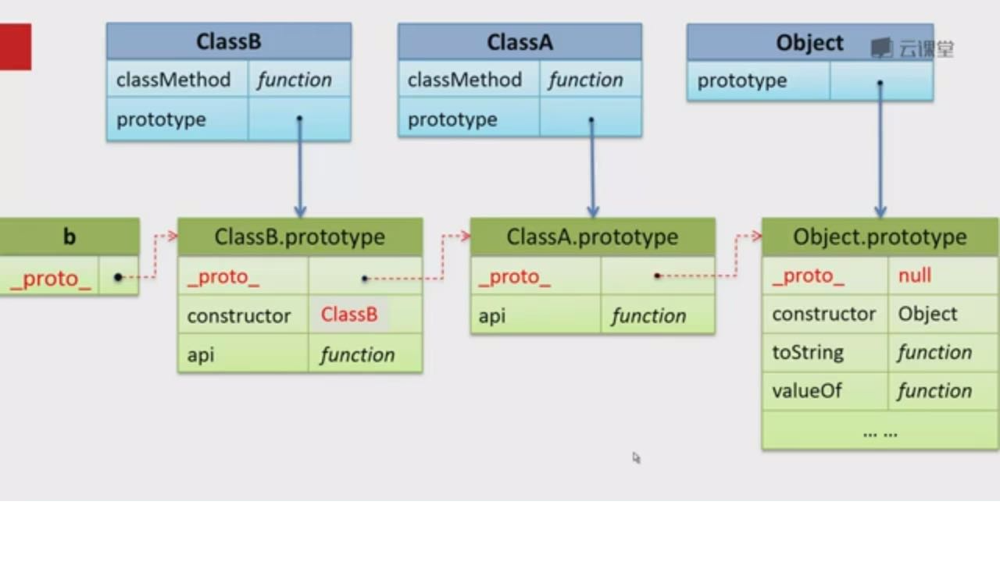
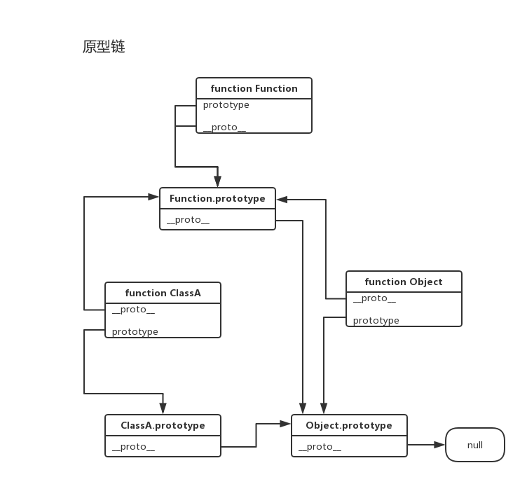

## 比较OC和JS的继承体系结构

### OC

#### Objective-C对象的结构：

|Objective-C 对象的结构图|
------|
ISA指针|
根类的实例变量|
倒数第二层父类的实例变量|
...|
父类的实例变量|
类的实例变量|

#### 对象、类对象、元类对象

- 每个对象内部有一个isa指针，指向类对象
- 类对象组成
- - isa指针，指向元类对象
- - super_class，指向父类
- - ivar_list 成员变量列表（成员变量名字、在对象内存中的偏移量等信息）
- - property_list 属性列表（属性的名字、attributes等信息）
- 元类对象组成
- - isa指针，指向根元类对象
- - super_class，指向父元类对象
- - property_list 属性列表（属性的名字、attributes等信息）


#### 方法执行

>objc是动态语言，每个方法在运行时会被动态转为消息发送，即：objc_msgSend(receiver, selector)。

OC在向一个对象发送消息时，runtime库会根据对象的isa指针找到该对象的类对象，然后在该类中的方法列表以及其父类方法列表中寻找方法运行。其实为了加快运行时速度，先查找方法缓存列表，没有缓存则创建，仍旧没有则向父类查询。

然后在发送消息的时候，objc_msgSend方法不会返回值，所谓的返回内容都是具体调用时执行的。 


### JS

#### 私有变量和函数

```
    function Box(){
        var color = "blue";//私有变量
        var fn = function(){ //私有函数
            
        }
    }
```

函数对象外部无法访问变量color和fn，它们就是私有的了

```
    var obj = new Box();
    console.log(obj.color);//undefined
    console.log(obj.fn);//undefined
```

#### 静态变量和函数

当定义一个函数后通过点号 “.”为其添加的属性和函数，通过对象本身仍然可以访问得到，但是其实例却访问不到，这样的变量和函数分别被称为静态变量和静态函数。

```
    function Obj(){};

    Obj.num = 72;//静态变量
    Obj.fn = function() {  //静态函数
        
    }  
    
    console.log(Obj.num);//72
    console.log(typeof Obj.fn)//function
    
    var t = new Obj();
    console.log(t.name);//undefined
    console.log(typeof t.fn);//undefined
```

#### 实例变量和函数

在面向对象编程中除了一些库函数我们还是希望在对象定义的时候同时定义一些属性和方法，实例化后可以访问，js也能做到这样

```
    function Box(){
        this.a=[]; //实例变量
        this.fn=function(){ //实例方法
                    
        }
    }
            
    console.log(typeof Box.a); //undefined
    console.log(typeof Box.fn); //undefined
            
    var box=new Box();
    console.log(typeof box.a); //object
    console.log(typeof box.fn); //function
```

为实例变量和方法添加新的方法和属性

```
    function Box(){
        this.a=[]; //实例变量
        this.fn=function(){ //实例方法
       
        }
    }
            
    var box1=new Box();
    box1.a.push(1);
    box1.fn={};
    console.log(box1.a); //[1]
    console.log(typeof box1.fn); //object

    var box2=new Box();
    console.log(box2.a); //[]
    console.log(typeof box2.fn); //function
```

在box1中修改了a和fn，而在box2中没有改变，由于数组和函数都是对象，是引用类型，这就说明box1中的属性和方法与box2中的属性与方法虽然同名但却不是一个引用，而是对Box对象定义的属性和方法的一个复制。

这个对属性来说没有什么问题，但是对于方法来说问题就很大了，因为方法都是在做完全一样的功能，但是却又两份复制，如果一个函数对象有上千和实例方法，那么它的每个实例都要保持一份上千个方法的复制，这显然是不科学的，这可肿么办呢，prototype应运而生。


#### 原型

我们创建的每个函数都有一个prototype属性，这个属性是一个指针，指向一个对象，这个对象的用途是包含可以由特定类型的所有实例共享的属性和方法。那么，prototype就是通过调用构造函数而创建的那个对象实例的原型对象。

只有函数才有prototype属性并且可以访问到，但是对象实例不具有该属性，只有一个内部的不可访问的`__proto__`属性。`__proto__`是对象中一个指向相关原型的神秘链接。按照标准，`__proto__`是不对外公开的，也就是说是个私有属性

使用原型的好处是可以让对象实例共享它所包含的属性和方法。

#### 构造函数、实例和原型对象的区别



- 实例就是通过构造函数创建的。实例一创造出来就具有`__proto__`属性（指向原型对象）
- 构造函数中有一个prototype属性，指向它的原型对象。
- 原型对象内部也有一个指针（constructor属性）指向构造函数:Person.prototype.constructor = Person;

#### 原型链

当从一个对象那里调取属性或方法时，如果该对象自身不存在这样的属性或方法，就会去自己关联的prototype对象那里寻找，如果prototype没有，就会去prototype关联的前辈(.__proto__)prototype那里寻找，依次类推，直到Prototype.….Prototype为undefined（Object的Prototype就是undefined）从而形成了所谓的“原型链”。



在原型链的末端，就是Object构造函数prototype属性指向的那个原型对象。这个原型对象是所有对象的祖先，这个老祖宗实现了诸如toString等所有对象天生就该具有的方法。其他内置构造函数，如Function，Boolean，String，Date和RegExp等的prototype都是从这个老祖宗传承下来的，但他们各自又定义了自身的属性和方法，从而他们的子孙就表现出各自宗族的那些特征。




#### __proto__属性和prototype属性的区别

- prototype是function对象中专有的属性。 
- `__proto__`是普通对象的隐式属性，在new的时候，会指向prototype所指的对象； 
- `__ptoto__`实际上是某个实体对象的属性，而prototype则是属于构造函数的属性。`__ptoto__`只能在学习或调试的环境下使用。


### 参考

- [JavaScript学习总结（五）原型和原型链详解](https://segmentfault.com/a/1190000000662547)

