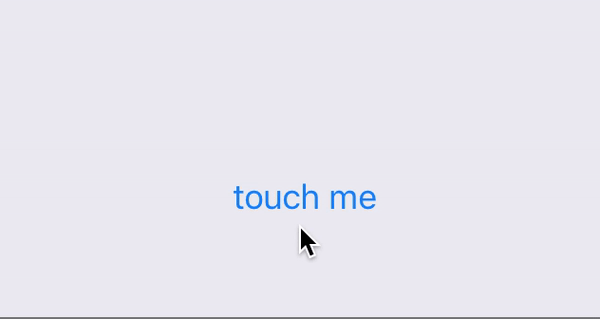
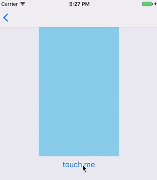

## 动画

### 准备工作

本文基于react-native 0.47版本，提供两个动画系统：

- `Animated` : 细粒度的交互动画
- `LayoutAnimation` : 动画在全局布局上


### Animated

#### Animated API

##### 1. 动画值

- Value
- AnimatedValueXY

我们可以操作的动画值有两种，一种是简单值，一种是二维矢量值。
初始化一个动画值： new Animated.Value(0) 或 new Animated.ValueXY(0, 0)

##### 2. 动画设置函数

- decay     //衰减的。以一个初始速度开始，逐渐变慢到结束
- timing    //用[Easing](https://facebook.github.io/react-native/docs/easing.html)方法操作动画值
- spring    //弹簧的
- delay (特殊的timing) //延迟执行

每个方法以不同的`动画曲线`控制`动画值`从初始值到最终值。
上面的方法返回的对象可以start()或者stop()来控制动画开始或者结束。

##### 3. 动画值生成函数

- add 
- divide
- multiply
- modulo
- diffClamp

可以对两个动画值进行加、除、乘、模等运算，生成一个新动画值。
动画值的interpolate方法可以传入range映射输出（插值运算，更多关于插值需要看Interpolation.js文件）

##### 4. 控制多个动画设置函数

- sequence  //按顺序执行，执行完一个再执行下一个
- parallel  //一组动画同时执行
- stagger   //按顺序执行，一个动画开始后下一个动画在指定延迟执行
- loop      

上面方法控制的是"动画设置函数"（timing等）的开始和结束的方式。

- event

手势（panning、scrolling等）或者其他 events 可以直接使用Animated.event方法映射动画值。

- createAnimatedComponent

`只有可动画的组件才能动画`，createAnimatedComponent 方法可以让组件可动画，Animated 直接提供了下面4个可动画的组件，就是使用的这个方法包装的：

- Animated.Image
- Animated.Text
- Animated.View
- Animated.ScrollView

#### 一个基于Animated的创建过程：

1. 初始化一个动画值（new Animated.Value(0)）
2. 把这个动画值绑定到一个可动画组件的style属性上（style={{opacity: animValue}}）
3. 设置这个动画值的变化方法（Animated.timing等方法）
4. 开始动画（Animated.timing().start()）

#### 一个简单的动画

使用上面的创建过程，实现一个简单的动画，动画效果如下：



代码如下：

```
class Simple extends Component {
  constructor(props) {
    super(props)
    this.state = {
      /*
       1. 初始化动画值
       * */
      fadeAnim: new Animated.Value(0)
    }
  }

  render() {
    return (
      <View style={{ flex: 1, alignItems: 'center', justifyContent: 'center' }}>
        <Animated.Text style={{
          /*
           2. 将动画值绑定到style的属性
           * */
          opacity: this.state.fadeAnim
        }}>
          Simple Animated Used Animated.timing
        </Animated.Text>
        <Button title="touch me"
                onPress={() => {
                  /*
                   3. 处理动画值，并启动动画
                   * */
                  Animated.timing(
                    this.state.fadeAnim,
                    {
                      duration: 1000,
                      toValue: 1
                    }
                  ).start()
                }} />
      </View>
    )
  }
}
```

#### 一个稍微复杂的动画

要知道，一个动画值只能由一个变化的原因，就是不能被多个动画设置函数（timing等）操控。但是一个动画值可以绑定多个style属性。

我们做一个动画，控制一个View的opacity、translateX 和 scale，这三个属性都绑定一个动画值。

动画效果如下：



代码如下： 

```
class SingleValueToMultiProps extends Component {
  constructor(props) {
    super(props)
    this.state = {
      /*
       初始化动画值
       * */
      animValue: new Animated.Value(1),
      currentValue: 1, //标志位
    }
  }

  render() {
    return (
      <View style={{ flex: 1, alignItems: 'center' }}>
        <Animated.View style={{
          width: '50%',
          height: '50%',
          backgroundColor: 'skyblue',
          /*
           将动画值绑定到style的属性
          * */
          opacity: this.state.animValue, //透明度动画
          transform: [ //位置动画（可以思考一下：下面的元素顺序不同会有不同效果）
            {
              translateX: this.state.animValue.interpolate({
                inputRange: [0, 1],
                outputRange: [300, 0] //线性插值，0对应-100，1对应0
              })
            },
            {
              scale: this.state.animValue, //大小动画
            },
          ]
        }} />
        <Button title="touch me"
                onPress={() => {
                  /*
                   处理动画值，并启动动画
                   * */
                  this.state.currentValue = this.state.currentValue == 1 ? 0 : 1
                  Animated.timing(this.state.animValue, {
                      toValue: this.state.currentValue,
                      duration: 1500,
                  }).start()
                }} />
      </View>
    )
  }
}
```

#### 控制多个动画

我们拿Animated.stagger()举例，控制一个动画开始后0.25秒开始下一个动画。

```
const animations = [
      Animated.timing(
        this.state.skyAnimValue,
        {
          toValue: 1,
        }),
      Animated.timing(
        this.state.redAnimValue,
        {
          toValue: 1,
        }),
      Animated.timing(
        this.state.greenAnimValue,
        {
          toValue: 1,
        })
    ]
Animated.stagger(250, animations).start()
```

注意：sequence、parallel、stagger、loop 方法控制的是"动画设置函数"的开始和结束的方式，所以传入的是一组对动画值操作后的对象，即timing等方法调用后的对象。

#### events 事件控制动画

使用events事件控制动画，实际上就是替换了上面的“动画设置函数”，动画值不再由“动画设置函数”来控制，而是由events来控制。

比如scrolling的event，可以用滚动的偏移量来设置动画值：

```
onScroll={Animated.event([{ nativeEvent: { contentOffset: { y: this.state.offsetYAnim } } }])}
```

比如panning的event，可以用手势在页面的位置设置动画值：

```
onPanResponderMove: Animated.event([{ nativeEvent: { pageX: this.state.animValue } }])
```

### LayoutAnimation

在下一次渲染时，自动让views动画到新状态。

一般在setState之前调用LayoutAnimation.configureNext(config)方法。

#### LayoutAnimation API

- configureNext //配置动画在下一次渲染时发生

其中config组成如下：

```
type Config = {
  duration: number,
  create?: Anim,  //创建views时的动画配置
  update?: Anim,  //更新views时的动画配置
  delete?: Anim,  //删除views时的动画配置
}
```

其中create、update、delete的组成如下：

```
type Anim = {
  duration?: number,
  delay?: number, //延迟
  springDamping?: number,   //弹簧阻尼系数（配合type=spring时使用）
  initialVelocity?: number, //初始速度
  type?: $Enum<typeof TypesEnum>, 
  property?: $Enum<typeof PropertiesEnum>,
}
```

- Types   //动画曲线类型
- - spring  //弹簧
- - linear  //线性
- - easeInEaseOut //缓入缓出
- - easeIn  //缓入
- - easeOut //缓出

- Properties  //动画的属性
- - opacity //透明度
- - scaleXY //缩放

- create 
- Presets

上面两个方法都能生成 configureNext 所需的 config，可以快捷的生成所需的 config。

- easeInEaseOut
- linear
- spring

上面的三个方法是由 configureNext.bind(null, Presets.xxx) 生成的，可以直接调用。

代码如下：

```
LayoutAnimation.configureNext({
              duration: 1000,
              create: {
                type: LayoutAnimation.Types.linear,
                property: LayoutAnimation.Properties.opacity,
              },
              update: {
                type: LayoutAnimation.Types.linear,
                property: LayoutAnimation.Properties.scaleXY,
              }
            })
            this.setState({
              size: this.state.bigTag ? 60 : 100,
              bigTag: !this.state.bigTag,
            })
```

[完整代码在这](https://github.com/liuyanhongwl/react-native-demos/tree/master/Animations)

#### 参考

- [官方关于动画的介绍](https://facebook.github.io/react-native/docs/animations.html)
- [Animated 官方文档](https://facebook.github.io/react-native/docs/animated.html)
- [LayoutAnimation 官方文档](https://facebook.github.io/react-native/docs/layoutanimation.html)


